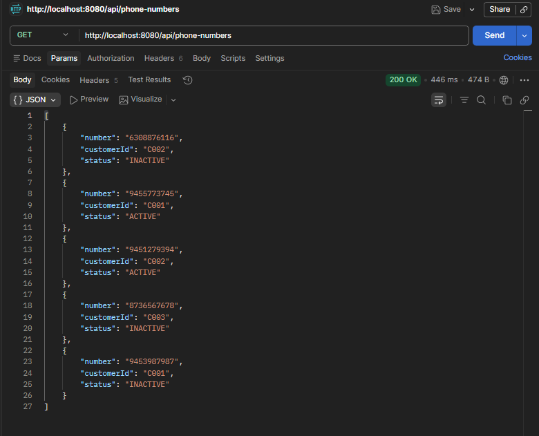
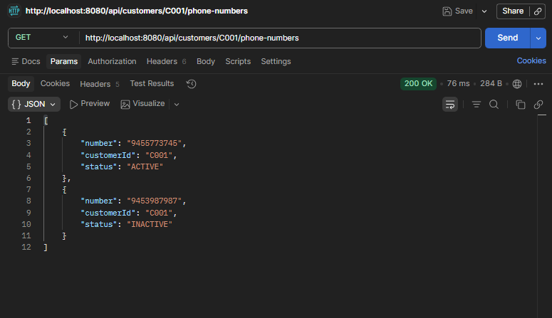
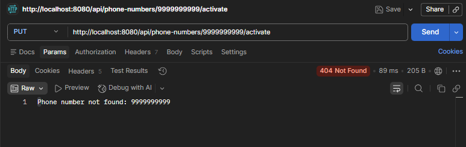

# Phone Number Service

## Approach

The problem was to design APIs for managing phone numbers for customers.

I followed a simple layered architecture:

- **Controller** → handles REST APIs
- **Service** → contains business logic
- **Repository** → stores data (in-memory)
- **Model** → represents phone number data

Since the requirement mentioned static data, I used an in-memory data structure instead of a database.

For storage, I used a `ConcurrentHashMap`:
- **Key** → phone number
- **Value** → `PhoneNumber` object

This allows fast lookup (O(1)) for activating a number.

---

## Design Decisions

- Used REST APIs with proper HTTP methods (`GET`, `PUT`)
- Used `Optional` to handle null-safe retrieval
- Activation API is idempotent (calling multiple times gives the same result)
- Returned empty list instead of error for a customer with no numbers
- Used custom exceptions with a global exception handler for proper HTTP status codes

---

## APIs Implemented

### 1. Get All Phone Numbers

```
GET /api/phone-numbers
```

**Response:**

```json
[
  {
    "number": "6308876116",
    "customerId": "C002",
    "status": "INACTIVE"
  },
  {
    "number": "9455773745",
    "customerId": "C001",
    "status": "ACTIVE"
  },
  {
    "number": "9451279394",
    "customerId": "C002",
    "status": "ACTIVE"
  },
  {
    "number": "8736567678",
    "customerId": "C003",
    "status": "INACTIVE"
  },
  {
    "number": "9453987987",
    "customerId": "C001",
    "status": "INACTIVE"
  }
]
```

---

### 2. Get Phone Numbers by Customer

```
GET /api/customers/{customerId}/phone-numbers
```

**Example:**

```
GET /api/customers/C001/phone-numbers
```

**Response:**

```json
[
  {
    "number": "9455773745",
    "customerId": "C001",
    "status": "ACTIVE"
  },
  {
    "number": "9453987987",
    "customerId": "C001",
    "status": "INACTIVE"
  }
]

```

**If customer does not exist:**

```json
[]
```

---

### 3. Activate Phone Number

```
PUT /api/phone-numbers/{number}/activate
```

**Example:**

```
PUT /api/phone-numbers/9453987987/activate
```

**Response:**

```json
{
  "number": "9453987987",
  "customerId": "C001",
  "status": "ACTIVE"
}
```

---

### 4. Activate Non-Existing Number

```
PUT /api/phone-numbers/9999999999/activate
```

**Response — `404 Not Found`:**

```
Phone number not found: 9999999999
```

---

## Testing

I tested all APIs using Postman.

**Covered cases:**

- Fetch all numbers
- Fetch by customer (valid + invalid)
- Activate number (inactive → active)
- Activate already active number (idempotent)
- Activate non-existing number (error case)

---

## Postman Screenshots

### Get All Phone Numbers


### Get Numbers by Customer


### Activate Phone Number



---

## How to Run

1. Clone the repository
2. Open in IDE (IntelliJ)
3. Run the main class
4. Application runs on: `http://localhost:8080`

---

## Notes

- Data is initialized at application startup
- No database is used as per requirement
- Solution can be extended to use a database easily by changing the repository implementation